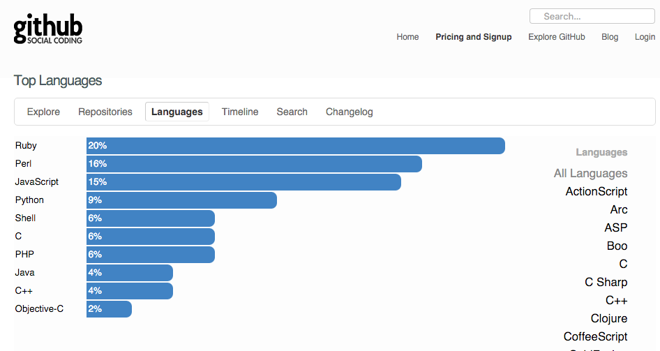
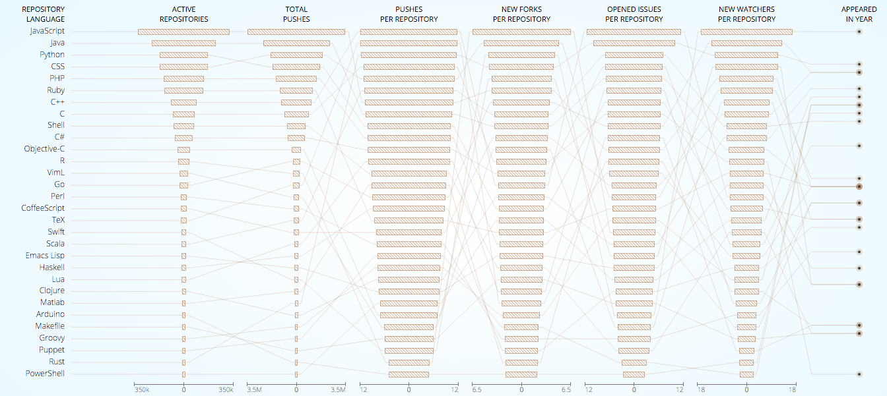

Short background: I have been doing front end development professionally for 7 years, but personally started about 12 years ago. This is just to illustrate  
the timeframe I have been exposed to JavaScript development.

Ill start at about 2010, when I feel like JavaScript was really starting to take  
off as a serious career path. Before then, JavaScript seemed like something in addition to knowing another programming language and of course, html and css. CSS 3 and HTML 5 were just starting to be talked about as something you could use in the future. At the time it was hard seeing ie6 support dying off, windows users wanted to keep Windows XP.

Github early 2010

Github was starting to take off, people began to use Stack Overflow. Things were looking pretty great on the web. Things became a lot easier to find. The mobile web became important. I remember going to An Event Apart (2010 San Diego). Responsive web stuff was now a thing. CHROME DEV TOOLS!

Directories filled with copied libraries. If you wanted to support all the browsers you were using jquery. Our “module system” was wrapping everything in closure functions to not pollute the global space. JQUERY PLUGINS. Oh god jquery plugins. You were lucky if they had documentation, were ever updated, or what version of jquery it supported. It wasn’t jquery’s fault. Their plugin system was (is) pretty amazing for the time.

We needed books like “The Good Parts” to show us the way. JSLint was not out until the later part of 2010. News of Nodejs coming out. Everything started _moving_, and it hasn’t really stopped.

Bower, NPM, Grunt, Gulp, Webpack, JSHint, Backbone, Angualar, React, Ember, QUnit, Mocha, Jasmine, Requirejs, Browserify, and countless others that were only hot for a few months that I can’t remember.

We have come a long way since just including script tags on the page in a specific order to make sure the right variables were available. No longer are we concatenating files and hoping it gets it right. We have commonjs, requirejs, and the ES6 module system to help us with that.

So I have been on this ride for a while.

Github language popularity in 2015

#### I think where we are headed is amazing.

I could argue that being a JavaScript developer is better now than it has ever been. We have amazing tools, large and small companies dedicating teams to open source.

Now that JavaScript and the web is a truly amazing application platform, tools and libraries will continue to mature. I can see us soon having native type checking, immutable data structures, more IDE features. We have some great people leading the efforts for the **ECMAScript** project. I don’t want them to stop (maybe focus on more functional aspects :D).

We have it good. This does not mean we don’t have issue or that fatigue is not real. Lets solve those problems too.

#### Help with the fatigue

The community looks to be solving this problem with some new tools (lol), but for now, here are some tips I have learned to help with fatigue.

- Stop listening. Really. Take a month of not looking on twitter  
  and Hacker News. You will find that most of what you knew a month ago works as well as what you know now.
- Stop feeling like you need to use the new thing. Should you keep  
  learning new things? Yes. Always.
- Learn to read through the garbage to find the gems  
  you can use (or find interesting) to use at work.

What can you do to help? **Keep making new things. Keep making new frameworks.** Just don’t assume its the next best thing. Everyone has good ideas, but it can take years to turn a good idea into something stable that we can all use. Don’t impose your new ideas on coworkers without giving time to research those ideas. **Get good at vanilla JavaScript**.

Most of my new projects really don’t have that many libraries. Most of those libraries are the same ones I used last year. I think the only thing growing in my projects are rc files :(
